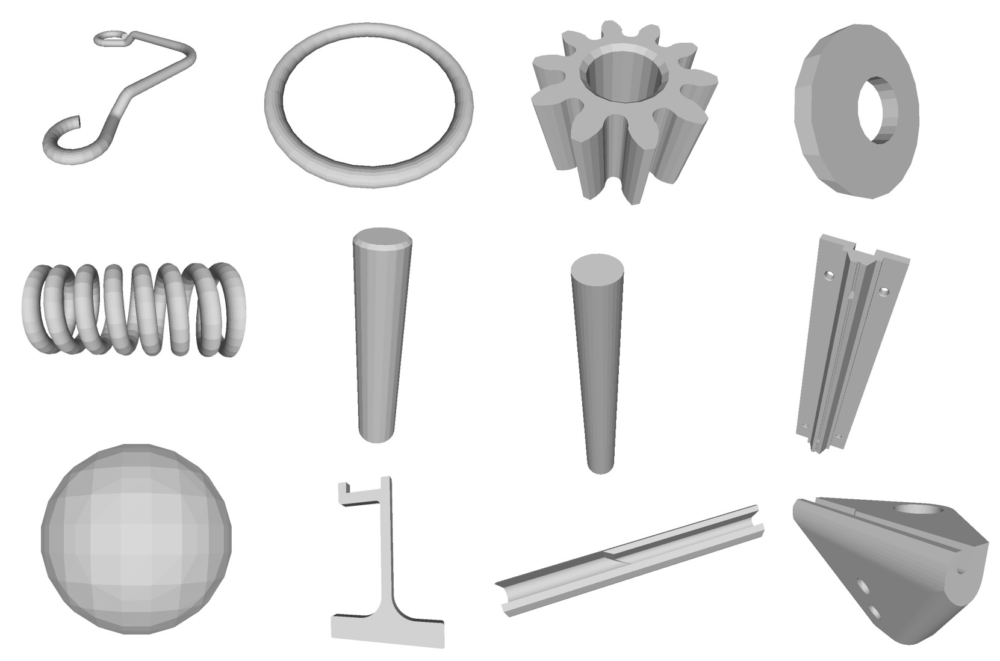
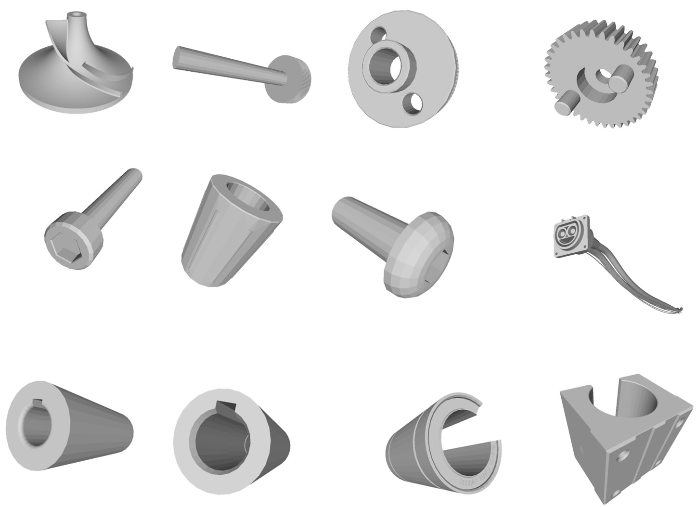
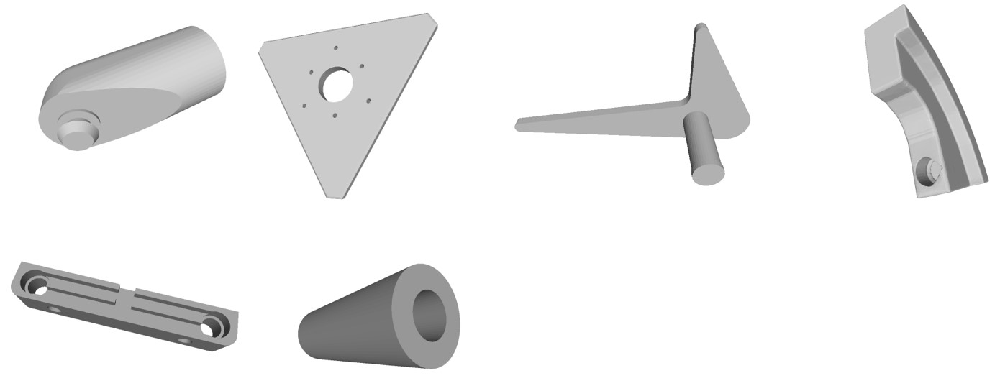
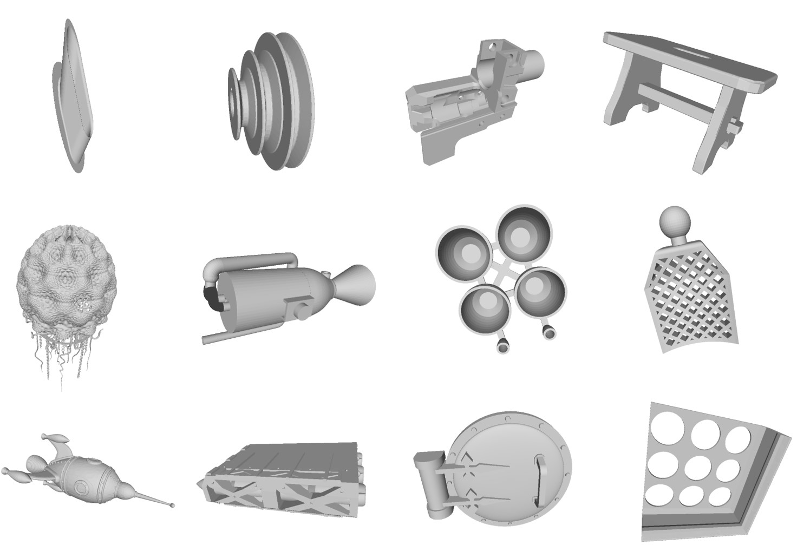
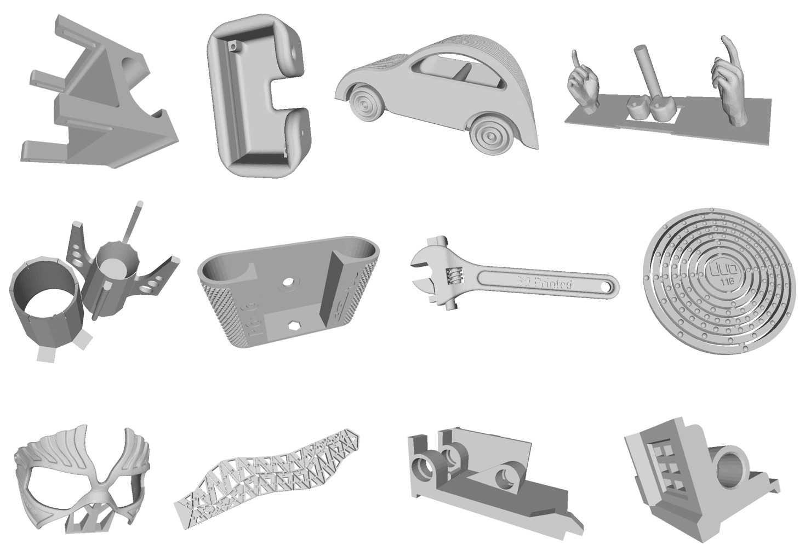
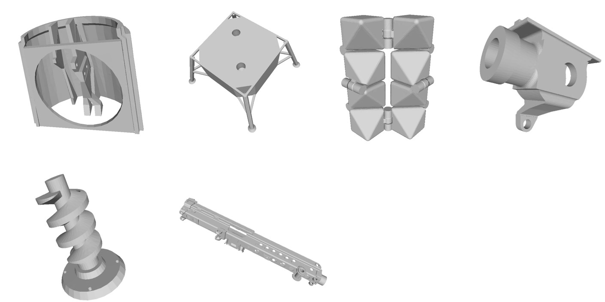
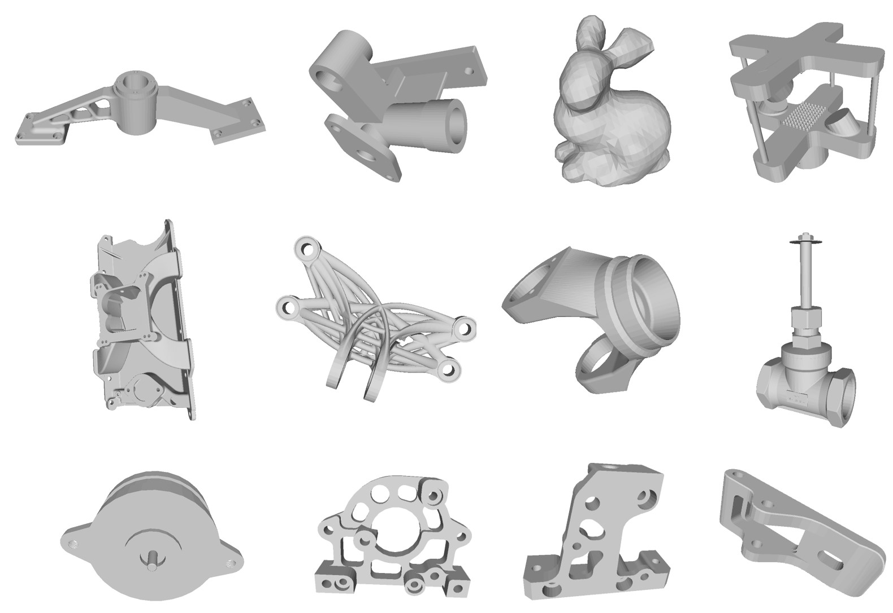
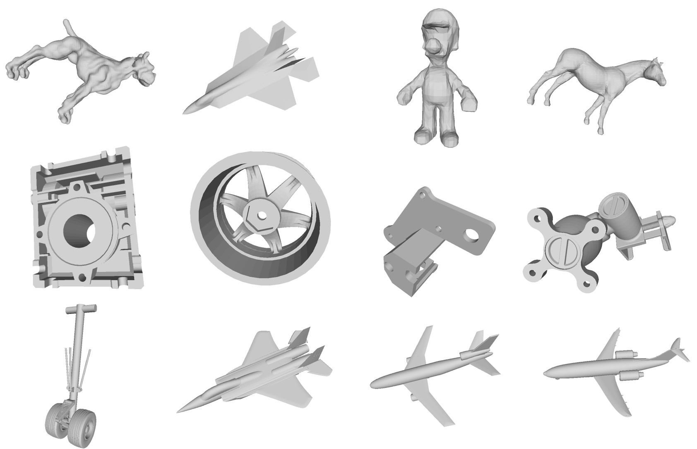
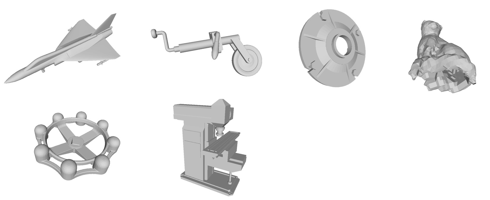

# Robust Slicer and Test Cases for Dirty Meshe Slicing (DirtyMeshSlicer)

- By: Yaonaiming Zhao and Qiang Zou (built on top of Charlie C.L. Wang's MeshWorks)
-  email: qzou.code@gmail.com
- webpage: https://qiang-zou.github.io/
- Latest Release: 2024.05.20

## !important
The source code was developed as a byproduct of the projects and methods presented in [1-4].

It can be compiled with QT 6.2.4 + GCC 11.4.0 , and run on the operating system Ubuntu 22.04 LTS. Windows, Mac, and other compilers should also work.


1.Copyright
-----------

- DirtyMeshSlicer is GNU licensed. It is developed and maintained by Yaonaiming Zhao and Qiang Zou for research use. All rights about the program are reserved by Yaonaiming Zhao and Qiang Zou. This C++ source codes are available only to a primary user for academic purposes. No secondary use, such as copy, distribution, diversion, business purpose, etc., is allowed. In no event shall the author be liable to any party for direct, indirect, special, incidental, or consequential damage arising out of the use of this program. DirtyMeshSlicer is self-contained.


2.Download
----------

- The source code, as well as the test cases, can be downloaded from: https://github.com/Qiang-Zou/DirtyMeshSlicer
  

3.Installing & Compiling (Windows/Linux/Mac + QT 6.2.4 + GCC 11.4.0)
-------------------------------------------

- Download the source code of [TetWild]([Yixin-Hu/TetWild: Robust Tetrahedral Meshing in the Wild. (github.com)](https://github.com/Yixin-Hu/TetWild)) , [fast-winding-number-soups](https://github.com/GavinBarill/fast-winding-number-soups) , and [PoissonRecon](https://github.com/mkazhdan/PoissonRecon) to a place as you see fit. Then use CMake & GCC to build the fast-winding-number-soups and PoissonRecon projects to obtain the binary executable file in this way (the unix way):

```shell
cd fast-winding-number-soups/PoissonRecon
mkdir build
cd build
cmake ../
make
```

- After that, download the source code of this project and make sure that the paths of several TetWild files in CMakeLists.txt is right. Then build this project with the same way of fast-winding-number-soups and PoissonRecon mentioned before.

4.Usage
-------

- After the compilation you can run the executable file 3DPrintPlanner inside the ./build directory.

- To slice a model, you can simply right click in the GUI, and navigate to "Slice->Dirty Mesh Slicer". After that you will be asked to input several necessary parameters through the terminal to run the program. Firstly, you can choose whether to use the surface repair methods. Three candidate methods are provided, including [TetWild](https://dl.acm.org/doi/10.1145/3197517.3201353), [Poisson Surface Reconstruction](https://dl.acm.org/doi/10.5555/1281957.1281965), and Winding Number Field based [Marching Cubes](https://dl.acm.org/doi/10.1145/37402.37422) Reconstruction. Secondly, you will be asked to input the thickness, and then the slicing will start working. 

5.File format
-------------

- The input file should be `.stl` or `.obj` format. The output file is a `.cli` file in binary format which can be directly input into 3D printing applications.

## 6.Data Set

A data set including 90 test cases with three levels of complexity (from simple, moderate, to complex) is also provided in the directory `DataSet`. This data set contains many dirty meshes with corruptions including open surface, inverted surface, non-manifold, and crack. We hope that this dataset can serve as a standard test set for any slicers supporting dirty meshe models.

### **simple**







### **moderate**







### **complex**







## 7.Acknowledgements

- We thank Prof. Jin Huang and Mr. Haoran Sun for useful discussions on algorithms used to repair dirty mesh models.
- We used several useful libraries in our implement listed as follows. We would like to thank their authors. [TetWild](https://github.com/Yixin-Hu/TetWild) [fast-winding-number-soups](https://github.com/GavinBarill/fast-winding-number-soups) [PoissonReconstruction](https://github.com/mkazhdan/PoissonRecon)

8.References
-------------

- [1] Shengjun Liu, Tao Liu, Qiang Zou, Weiming Wang, Eugeni L. Doubrovski, and Charlie C.L. Wang, "Memory-efficient modeling and slicing of large-scale adaptive lattice structures", ASME Transactions - Journal of Computing and Information Science in Engineering, vol.21, no.6, 061003 (16 pages), May 2021.
- [2] Junhao Ding, Qiang Zou, Shuo Qu, Paulo Bartolo, Xu Song, Charlie C. L. Wang, STL-free design and manufacturing paradigm for high-precision powder bed fusion. CIRP Annals 70.1 (2021): 167-170.
- [3] Yaonaiming Zhao, Qiang Zou, Guoyue Luo, Jiayu Wu, Sifan Chen, TPMS2STEP: error-controlled and C2 continuity-preserving translation of TPMS models to STEP files based on constrained-PIA. Computer-Aided Design (2024).
- [4] Qiang Zou, Yunzhu Gao, Guoyue Luo, Sifan Chen, Meta-meshing and triangulating lattice structures at a large scale. Computer-Aided Design (2024).
